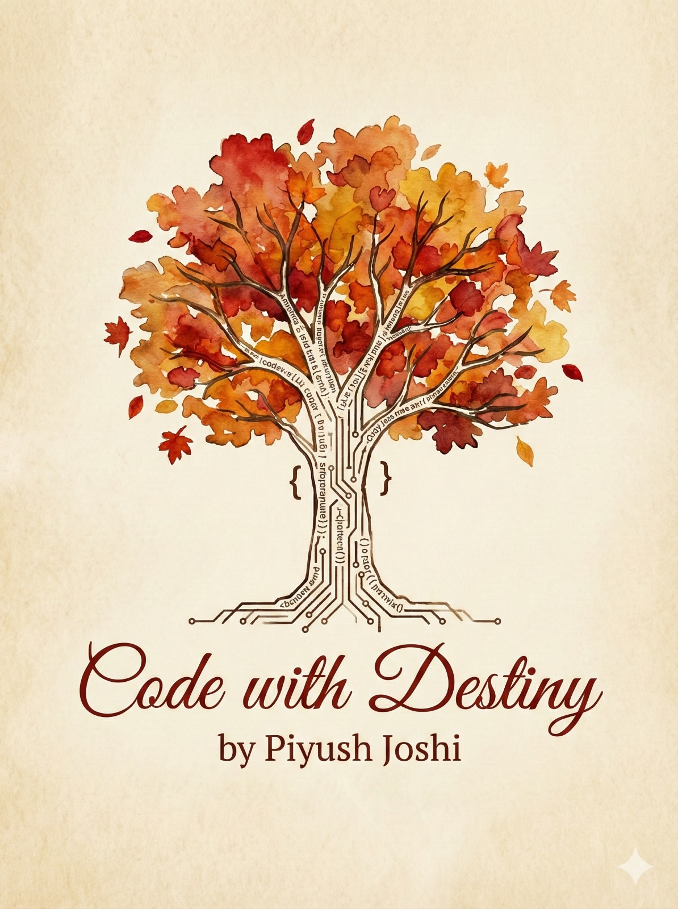
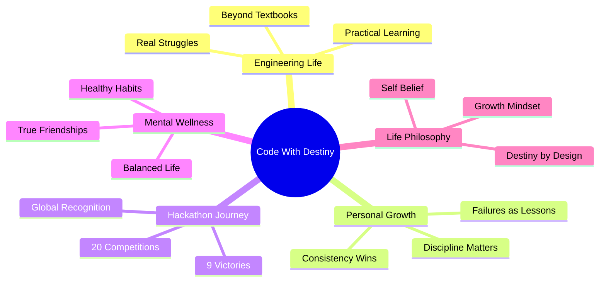
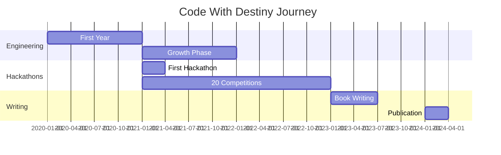

<div align="center">

<!-- Animated Header -->


<!-- 3D Rotating Badge -->
<picture>
  <source media="(prefers-color-scheme: dark)" srcset="https://readme-typing-svg.demolab.com?font=Fira+Code&size=32&duration=3000&pause=1000&color=FF6B35&center=true&vCenter=true&multiline=true&repeat=true&random=false&width=800&height=100&lines=by+Piyush+Joshi;%F0%9F%8D%82+Engineering+%7C+Life+%7C+Growth+%F0%9F%8D%82">

</picture>

<br/>

<!-- Animated Badges -->
<p align="center">
  
  
  
  
</p>

<br/>

<!-- 3D Book Cover Animation -->
<div style="perspective: 1000px; display: inline-block;">
  
</div>

<br/><br/>

<!-- Animated Divider -->


</div>

## 🍁 About the Book

> **"This book is not a technical guide—it is a life document written in the language of engineering."**

<table>
<tr>
<td width="50%">

### 📖 What's Inside?

**Code With Destiny** is a deeply personal yet relatable journey through engineering life, written from the lens of a student who learned to grow not just through code, but through:

- 🌟 **Chaos & Creativity**
- 💪 **Failures & Comebacks**
- 🤝 **Friendships & Growth**
- 🎯 **Discipline & Self-belief**
- 🏆 **Hustle & Success**

</td>
<td width="50%">

### 🎯 Book Theme

```javascript
const bookEssence = {
  genre: "Engineering Memoir",
  focus: [
    "Personal Growth",
    "Hackathon Journey",
    "Mental Health",
    "Real Experiences"
  ],
  for: "Every Engineering Student",
  language: "Simple, Honest & Relatable"
};
```

</td>
</tr>
</table>

<br/>

<!-- Animated Divider -->
<p align="center">
  
</p>

## 📚 Table of Contents

<details open>
<summary><b>🌱 Chapter 1: The First Commit</b></summary>

```python
def first_commit():
    """The beginning—entering engineering with dreams, confusion, and curiosity"""
    chapters = [
        "🎓 Welcome to Matrix: The shock of engineering culture",
        "🐛 The Semicolon Saga: Small mistakes, big lessons",
        "🌙 Hostel Midnights: Late nights, friendships, self-discovery",
        "📖 The First-Year Struggles: Adapting, failing, learning"
    ]
    return "The journey begins..."
```

**This chapter marks where it all started—the first year confusion, excitement, and survival mode.**

</details>

<details>
<summary><b>🎨 Chapter 2: Chaos, Cramming & Creativity</b></summary>

```cpp
class EngineeringLife {
public:
    vector<string> reality = {
        "⏰ All-Nighters & Submissions",
        "💻 Coding Everywhere",
        "🎭 Beautiful Chaos",
        "⚡ Last-Minute Engineer Life"
    };
    
    void embrace() {
        cout << "Engineering is messy—and this chapter embraces it." << endl;
    }
};
```

**The messy, chaotic, yet creative reality no syllabus teaches.**

</details>

<details>
<summary><b>🎢 Chapter 3: Results, Vacations & Life Lessons</b></summary>

```java
public class LifeLessons {
    String[] experiences = {
        "🏖️ Vacation Highs: Temporary relief and reflections",
        "😰 Result Panic: Anxiety, expectations, and reality",
        "💡 Motivation & Life Philosophy: Mindset over marks"
    };
    
    public String moral = "Life doesn't pause for results—and results don't define life.";
}
```

**The emotional rollercoaster between semesters.**

</details>

<details>
<summary><b>🏆 Chapter 4: The Hackathon Journey</b></summary>

```javascript
const hackathonJourney = {
  competitions: 20,
  wins: 9,
  milestones: [
    "🚀 Hackathon Hustle: Entering competitive innovation",
    "⚡ Tantra Hackathon: 6-Hour Sprint",
    "💰 Lakhpati Banne Ka Din: When effort pays",
    "🌍 A Message From Malaysia: Global exposure",
    "📈 20 Hackathons, 9 Wins: Consistency over luck",
    "🎓 Important Lesson: Growth beyond trophies"
  ],
  impact: "The turning point where confidence meets opportunity"
};
```

**From zero to 20 hackathons—the journey that changed everything.**

</details>

<details>
<summary><b>💪 Chapter 5: Healthy Habits, Healthier Mind</b></summary>

```rust
struct WellBeing {
    physical: Vec<&'static str>,
    mental: Vec<&'static str>,
}

impl WellBeing {
    fn new() -> Self {
        WellBeing {
            physical: vec![
                "🏸 Badminton & Gym",
                "🧘 Discipline & Routine"
            ],
            mental: vec![
                "🧠 Mental Clarity",
                "👥 The Real Ones Remain"
            ],
        }
    }
}

// Success without health is incomplete.
```

**Building a sustainable foundation for long-term success.**

</details>

<br/>

<!-- Animated Divider -->
<p align="center">
  
</p>

## 🎯 Who Should Read This Book?

<table>
<tr>
<td align="center" width="25%">
  
  <br/><b>Engineering Students</b>
  <br/><sub>Especially 1st & 2nd year</sub>
</td>
<td align="center" width="25%">
  
  <br/><b>Hackathon Enthusiasts</b>
  <br/><sub>Innovators & Problem Solvers</sub>
</td>
<td align="center" width="25%">
  
  <br/><b>Struggling Students</b>
  <br/><sub>Dealing with pressure & doubt</sub>
</td>
<td align="center" width="25%">
  
  <br/><b>Growth Seekers</b>
  <br/><sub>Who believe in the journey</sub>
</td>
</tr>
</table>

<br/>

## ✨ Writing Style

<div align="center">

| Aspect | Description |
|:------:|:------------|
| 📝 **Tone** | Simple, honest, and story-driven |
| 💭 **Content** | Real-life incidents & reflections |
| 🔧 **Technical** | Used symbolically, not academically |
| 💖 **Emotion** | Relatable yet motivating |
| 🎯 **Purpose** | To connect, not to impress |

</div>

<br/>

<!-- Code Block with Syntax Highlighting -->
<div align="center">

```c
#include <life.h>
#include <destiny.h>

int main() {
    printf("🍂 Just like code, life throws errors.\n");
    printf("🐛 But every bug fixes you a little more.\n");
    printf("🚀 Keep committing to your destiny.\n");
    
    printf("\n💫 Welcome, Reader! 💫\n");
    
    return 0;
}
```

</div>

<br/>

<!-- Animated Divider -->
<p align="center">
  
</p>

## 🌟 Author's Note

<div align="center">
<table>
<tr>
<td>

> 💬 **"This book is written not to impress, but to connect."**
>
> If you've ever doubted yourself, felt lost in engineering, or wondered whether the struggle is worth it—**this book is for you**.
>
> Just like code, life throws errors. But every bug fixes you a little more. 🐛✨
>
> — **Piyush Joshi**

</td>
</tr>
</table>
</div>

<br/>

## 🔗 Get Your Copy

<div align="center">

### 🌐 Official Website

<a href="https://destinycode.netlify.app/" target="_blank">
  
</a>

<br/><br/>

### 📱 Connect & Share

<a href="https://destinycode.netlify.app/" target="_blank">
  
</a>
<a href="#" target="_blank">
  
</a>
<a href="#" target="_blank">
  
</a>
<a href="#" target="_blank">
  
</a>

</div>

<br/>

<!-- Stats Section -->
<div align="center">

## 📊 Book Impact


</div>

<br/>

<!-- Animated Divider -->
<p align="center">
  
</p>

## 💡 Key Takeaways

<div align="center">



</div>

<br/>

## 🎓 Testimonials

<div align="center">

| 💬 Reader Feedback |
|:-------------------|
| *"Finally, a book that gets what engineering students actually go through!"* |
| *"Not just another technical book—it's a survival guide with soul."* |
| *"The hackathon journey section gave me the push I needed to participate!"* |
| *"Relatable, real, and refreshingly honest. A must-read for every student."* |

</div>

<br/>

<!-- Animated Divider -->
<p align="center">
  
</p>

## 🚀 Quick Navigation

<div align="center">

| Section | Description | Link |
|:-------:|:------------|:----:|
| 🏠 | Official Website | [Visit](https://destinycode.netlify.app/) |
| 📖 | Read Sample Chapter | [Preview](#) |
| 🛒 | Purchase Book | [Buy Now](#) |
| 💬 | Author Contact | [Connect](#) |
| ⭐ | Leave Review | [Review](#) |

</div>

<br/>

## 🎨 Book Highlights

<div align="center">

### 🔥 Most Impactful Chapters

```diff
+ Chapter 4: The Hackathon Journey - 20 competitions, 9 wins, infinite lessons
+ Chapter 2: Chaos, Cramming & Creativity - The beautiful mess of engineering
+ Chapter 5: Healthy Habits, Healthier Mind - Sustainable success strategies

! Remember: Every line of code changed my destiny
! Your story is being written with every choice you make
```

</div>

<br/>

<!-- Activity Graph -->
<div align="center">

## 📈 Journey Timeline



</div>

<br/>

<!-- Animated Divider -->
<p align="center">
  
</p>

## 🌳 The Philosophy

<div align="center">

<table>
<tr>
<td width="60%">

### 🍂 Growth Through Code

Just as a tree grows ring by ring, season by season, an engineering student grows through:
- Each failed compilation
- Every debugging session
- Late-night study marathons
- Hackathon victories and defeats
- Friendships forged in struggle
- Habits built through discipline

The circuit-board roots represent our technical foundation, while the autumn leaves symbolize the constant change and growth we experience. **Every season teaches. Every error educates.**

</td>
<td width="40%">

```python
class Destiny:
    def __init__(self):
        self.dreams = []
        self.failures = []
        self.wins = []
    
    def code_it(self):
        while True:
            try:
                self.pursue_dreams()
            except Failure as e:
                self.learn(e)
                self.failures.append(e)
            else:
                self.wins.append("Success")
            finally:
                self.grow()
    
    def __str__(self):
        return "Keep Coding 🚀"
```

</td>
</tr>
</table>

</div>

<br/>

## 📌 Important Notes

> **⚠️ This Book Is NOT:**
> - ❌ A technical programming tutorial
> - ❌ A get-rich-quick guide
> - ❌ Just another motivational book
> - ❌ Full of unrealistic success stories

> **✅ This Book IS:**
> - ✨ A real journey with real struggles
> - 💪 Honest about failures and comebacks
> - 🎯 Practical wisdom from lived experience
> - 🌟 Relatable for every engineering student

<br/>

<!-- Animated Divider -->
<p align="center">
  
</p>

## 🤝 Support & Feedback

<div align="center">

### 💌 Love the Book?

Your support means everything! Here's how you can help:

<table>
<tr>
<td align="center">
  
  <br/><b>Rate It</b>
  <br/><sub>Leave a review</sub>
</td>
<td align="center">
  
  <br/><b>Share It</b>
  <br/><sub>Tell your friends</sub>
</td>
<td align="center">
  
  <br/><b>Discuss It</b>
  <br/><sub>Join the community</sub>
</td>
<td align="center">
  
  <br/><b>Connect</b>
  <br/><sub>Reach out to author</sub>
</td>
</tr>
</table>

<br/>

### 📬 Get in Touch

<a href="mailto:your.email@example.com">
  
</a>
<a href="https://destinycode.netlify.app/">
  
</a>

</div>

<br/>

## 📜 License & Copyright

<div align="center">

```
Copyright © 2024 Piyush Joshi
All Rights Reserved

Code With Destiny is a registered literary work.
No part of this book may be reproduced without permission.
```


</div>

<br/>

<!-- Animated Divider -->
<p align="center">
  
</p>

## 🎯 Final Words

<div align="center">

### 🌟 Remember

<table>
<tr>
<td>

```javascript
const lifeAdvice = {
  message: "Every commit counts. Every error teaches.",
  wisdom: [
    "🌱 Start small, grow consistently",
    "🐛 Debug your life, not just your code", 
    "🤝 Collaborate, don't compete",
    "💪 Discipline beats motivation",
    "🎯 Code your own destiny"
  ],
  promise: "Your story matters. Your journey counts."
};

console.log("Keep pushing. Keep growing. Keep coding. 🚀");
```

</td>
</tr>
</table>

<br/>

### 🔥 Are You Ready to Code Your Destiny?

<a href="https://destinycode.netlify.app/" target="_blank">
  
</a>

<br/><br/>

### 📊 Repository Stats


</div>

<br/><br/>

<!-- Footer Wave -->


<div align="center">

### 💫 Made with ❤️ by Piyush Joshi

<sub>Every line of code changed my destiny. What will yours do?</sub>

<br/>

**⭐ Star this repository if you believe in the journey!**

</div>

---

<div align="center">
  
  
  
</div>
